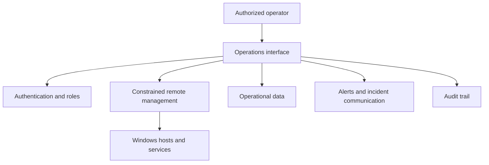

# Infrastructure Dashboard

> **Personal project notice:** This is a personal, sanitized demonstration project and is not affiliated with, sponsored by, or endorsed by any current or former employer. The repository is intended to contain only fictional/synthetic data and reusable interface ideas—not employer confidential or proprietary information, production configurations, customer data, credentials, or employer work product.

**Live demo:** https://dschunk.github.io/infrastructure-dashboard/

A public operations-interface case study showing how server health, service status, Windows events, storage, backups, tickets, messages, incidents, and audit history can be presented without turning the screen into a wall of meaningless green boxes.

## What this demonstrates

The repository contains a dependency-free responsive front end built with semantic HTML, modern CSS, and vanilla JavaScript. Every operational value is fictional and exists only to demonstrate information architecture and interface design.

The demo includes:

- host and service health
- storage and backup state
- Windows event triage
- managed-system status
- operational audit history
- responsive desktop/mobile layouts
- an accessible command palette with `Ctrl+K`
- searchable quick actions
- simulated incident lifecycle and recovery state
- clipboard-ready status summaries
- deliberate degraded-state communication

Open the live demo or run `index.html` locally. No build step is required.

## Design rules

- **Status must mean something.** A green card should represent a verified condition, not decoration.
- **Failure must be visible.** Degraded and unknown states deserve first-class presentation.
- **Operators need context.** Ownership, timestamps, last-known state, and audit history matter as much as the headline metric.
- **Do not rely on color alone.** Status language, icons, labels, and hierarchy should remain understandable without color perception.
- **Read and change are different operations.** Visibility should not imply permission to perform consequential actions.
- **Synthetic means synthetic.** Public demonstrations should never leak real infrastructure details just to look authentic.

## Case-study scope

- Windows host connectivity, health, disk, and uptime
- multi-instance service state
- events and process visibility
- storage and backup state
- internal tickets and staff messages
- role-aware operational concepts
- administrative audit history

The conceptual production architecture that inspired the case study looks like this:

This public repository contains **no** production source, credentials, addresses, hostnames, server keys, webhooks, private infrastructure diagrams, or real telemetry.

A production implementation should keep read operations separate from administrative actions. Consequential operations require explicit authorization and audit records; remote management should use constrained identities; secrets should be injected at runtime rather than stored in source.

## Front-end qualities

- semantic HTML and accessible landmarks
- keyboard-accessible navigation
- responsive command-center and mobile layouts
- status language that does not depend on color alone
- reusable CSS variables and layout primitives
- no framework or runtime dependency
- no analytics or cookies
- synthetic data clearly separated from real operational systems

## Related work

- [Windows IT Toolkit / SchunkOps](https://github.com/dschunk/windows-it-toolkit) — operational evidence and Windows administration tooling
- [SchunkOps Microsoft 365](https://github.com/dschunk/microsoft-365-ops) — read-only Microsoft 365 support and tenant engineering tools
- [Build It Like You Won't Be There Tomorrow](https://github.com/dschunk/build-it-like-you-wont-be-there) — runbook, monitoring, recovery, change, and handoff standards
- [Everyday IT Tips](https://everydayittips.com/) — practical infrastructure and Windows field guides
- [DavidSchunk.com](https://www.davidschunk.com/) — broader portfolio
