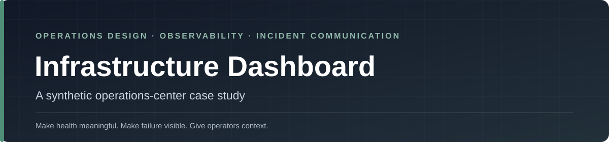
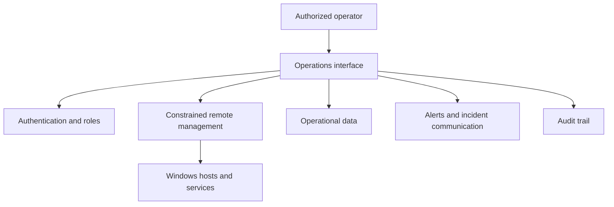

<p align="center">
  
</p>

<p align="center">
  <a href="https://dschunk.github.io/infrastructure-dashboard/"></a>
  <a href="https://github.com/dschunk/infrastructure-dashboard/actions/workflows/validate.yml"></a>
  <a href="LICENSE"></a>
</p>

# Infrastructure Dashboard

A dependency-free operations-interface case study showing how **health, degraded state, incidents, backups, events, tickets, messages, and audit history** can be presented without turning an operations screen into a wall of decorative green boxes.

Every value is synthetic. The engineering ideas are real.

> **Design principle:** status should communicate verified state, uncertainty, ownership, and what an operator should care about next.

## Why this project exists

Operations interfaces are often treated as decoration after the underlying systems are built. That is backwards.

A useful operations surface should help answer:

- What is healthy?
- What is degraded?
- What is unknown?
- What changed?
- Who owns the issue?
- When was the state last verified?
- Is the backup only “successful,” or is it actually restorable?
- What should an operator investigate first?
- Which actions are observational and which are consequential?

This project explores those questions with a public, sanitized front end.

## What the demo includes

- host and service health
- storage and backup state
- Windows event triage
- managed-system status
- incident lifecycle and recovery state
- operational audit history
- tickets and staff messages
- responsive desktop/mobile layouts
- keyboard-accessible navigation
- an accessible command palette with `Ctrl+K`
- searchable quick actions
- clipboard-ready status summaries
- deliberate degraded and unknown states

**[Open the live demo →](https://dschunk.github.io/infrastructure-dashboard/)**

## What to study

| Audience | Look at | Why |
|---|---|---|
| **IT / infrastructure engineer** | Health, incidents, backups, audit history | See how operational state can be summarized without hiding uncertainty |
| **Help desk / NOC** | Degraded-state communication, timestamps, ownership | Practice deciding what deserves escalation |
| **UI / product designer** | Hierarchy, keyboard access, status semantics | Study an operations UI where color is not the only signal |
| **Security / platform engineer** | Read-vs-change separation, synthetic data | Discuss safe public demonstrations and consequential-action boundaries |
| **Instructor / professor** | Whole case study | Use it for observability, operations design, accessibility, or incident-communication discussion |

## Design rules

- **Status must mean something.** Green should represent a verified condition, not decoration.
- **Failure must be visible.** Degraded and unknown states deserve first-class presentation.
- **Operators need context.** Ownership, timestamps, last-known state, and audit history matter as much as the headline metric.
- **Do not rely on color alone.** Labels, language, icons, and hierarchy should remain understandable without color perception.
- **Read and change are different operations.** Visibility should not imply authorization to perform consequential actions.
- **Synthetic means synthetic.** Public demonstrations should never leak real infrastructure details just to look authentic.

## Conceptual production architecture



A production implementation should keep read operations separate from administrative actions. Consequential operations should require explicit authorization and audit records; remote management should use constrained identities; secrets should be injected at runtime rather than stored in source.

## Classroom / discussion use

This repo works well as a case study because students can discuss operational behavior without needing access to real infrastructure.

Useful prompts:

1. Which cards represent facts, and which represent interpretations?
2. How should the interface distinguish **unknown** from **healthy**?
3. What context should accompany a backup-success indicator?
4. Which actions should require elevated authorization?
5. What audit information should exist after an administrative action?
6. How can the design remain understandable without relying on green/red color?
7. What would you remove before showing this interface publicly if it were connected to a real environment?

See the broader [Teaching & Classroom Guide](https://github.com/dschunk/dschunk/blob/main/docs/CLASSROOM.md).

## Run locally

No build step is required.

```text
clone repository
open index.html
```

The project is plain semantic HTML, CSS, and JavaScript.

## Front-end qualities

- semantic HTML and accessible landmarks
- keyboard-accessible navigation
- responsive command-center and mobile layouts
- status language that does not depend on color alone
- reusable CSS variables and layout primitives
- no framework or runtime dependency
- no analytics or cookies
- synthetic data clearly separated from real operational systems

## Public-project boundary

This repository contains **no production source, credentials, addresses, hostnames, server keys, webhooks, private infrastructure diagrams, employer material, or real telemetry**.

It is a personal, sanitized demonstration project and is not affiliated with, sponsored by, or endorsed by any current or former employer.

## Related work

- [Windows IT Toolkit / SchunkOps](https://github.com/dschunk/windows-it-toolkit) — Windows operations and incident evidence
- [SchunkOps Microsoft 365](https://github.com/dschunk/microsoft-365-ops) — read-only Microsoft 365 and tenant engineering tooling
- [Build It Like You Won't Be There Tomorrow](https://github.com/dschunk/build-it-like-you-wont-be-there) — runbook, monitoring, recovery, change, and handoff standards
- [Everyday IT Tips](https://everydayittips.com/) — practical infrastructure and Windows field guides
- [DavidSchunk.com](https://www.davidschunk.com/) — broader portfolio
